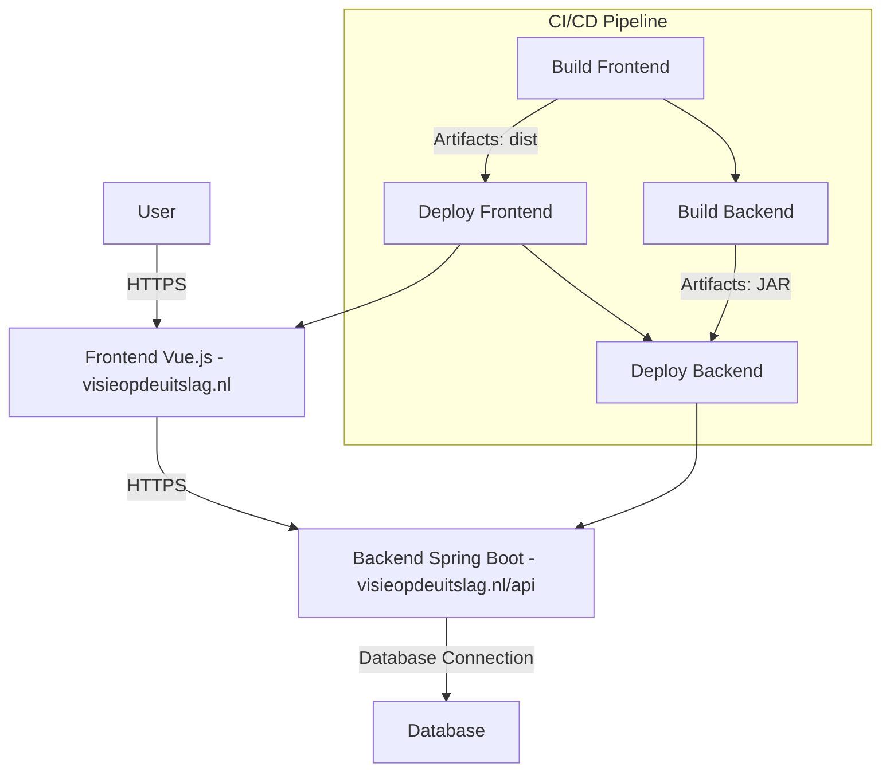
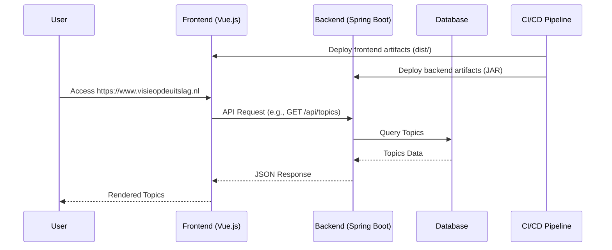

# Deployment documentation

**Hosting:** Digital Ocean
 
**Domain:** visieopdeuitslag
 
**Frontend url:** https://www.visieopdeuitslag.nl
 
**Backend url:** https://www.visieopdeuitslag.nl/api
 
**Port:** 7420

###  **Network Diagram**

---

### **Sequence Diagram**

