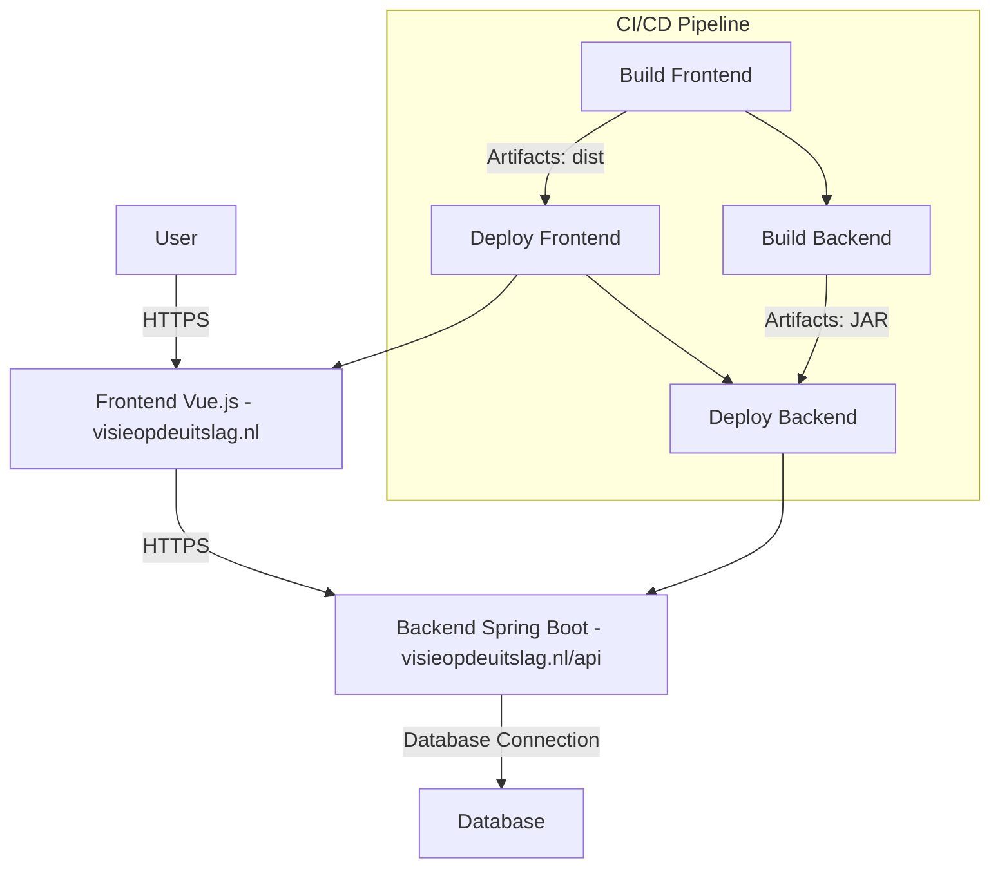
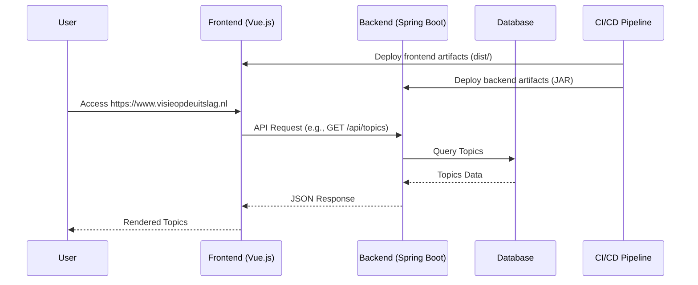

### Deployment, testing and sonarqube being ran by GitLab CI
[Commit where I fixed issues sonarqube found](https://gitlab.fdmci.hva.nl/semester-3-hbo-ict/onderwijs/student-projecten/2024-2025/out-r-se-cs/semester-1/siiquujuucii98/-/commit/d3b80b55bf93a51c0cf90898890b781e825ec644)


# Deployment documentation
## Main website:
- **Hosting:** Digital Ocean
- **Domain:** visieopdeuitslag
- **Frontend url:** https://www.visieopdeuitslag.nl
- **Backend url:** https://www.visieopdeuitslag.nl/api
 **Port:** 7420

###  **Network Diagram**


---

### **Sequence Diagram**


## Aaron's website:
- **Domain:** aaronlaan.com / aaronlaan.nl
- **Frontend url:** https://www.election.aaronlaan.com
- **Backend url:** https://www.election.aaronlaan.com/api
  **Port:** 7420

## Manual Deployment Guide Using Dockerfile
#### **Step 1: Export Docker Images**
1. Navigate to the root of the project containing our `docker-compose.yml` file.
2. Build the Docker images using the following command:
   ```bash
   docker compose up --build
   ```
   This command builds the Docker images for your frontend and backend services as defined in our `docker-compose.yml` file.

3. Export the built Docker images to `.tar` files:
   ```bash
   docker save -o frontend.tar elections-frontend:latest
   docker save -o backend.tar elections-backend:latest
   ```
    - `web.tar`: The Docker image for the frontend.
    - `api.tar`: The Docker image for the backend.

---

#### **Step 2: Set Up Docker Containers on the Server**
1. Transfer the exported `.tar` files (`web.tar` and `api.tar`) to the server, I use termius for this.

2. SSH into the server:
   ```bash
   ssh user@your-server-ip
   ```
   Or use a tool such as termius to connect to the server.

3. Navigate to the directory where you transferred the `.tar` files:
   ```bash
   cd /path/to/deployment
   ```

4. Load the Docker images into the server's Docker environment:
   ```bash
   docker load -i frontend.tar
   docker load -i backend.tar
   ```

---

#### **Step 3: Deploy Using Docker Compose**
1. Ensure that the `docker-compose.yml` file is present on the server. If not, transfer it to the server using the same method as in Step 1.

2. Start the services using Docker Compose:
   ```bash
   docker compose up -d
   ```
---
