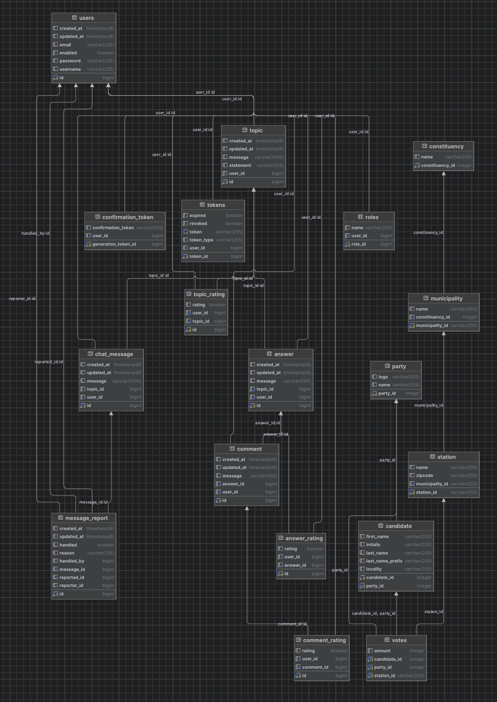

## Wireframe and prototypes

-  [Click here to see the designs in full](https://miro.com/app/board/uXjVLdw4xoY=/)

## ERD
### ERD Design

- [Click here to see in full](https://lucid.app/lucidchart/7d9b915d-70ea-4a6f-9597-307f37fe7174/edit?invitationId=inv_88ebd740-1a4a-4159-81ee-54d334bbf2ab&page=0_0#)

### Generated ERD by DataGrip

### Class diagram

- [Click to see in full](https://lucid.app/lucidchart/764afbe1-f78a-47ee-b405-f28b40ccee59/edit?invitationId=inv_65a81139-14b6-42e8-9eb3-b5fd41304a68&page=0_0#)

### Domain Diagram

### Implementation diagram
