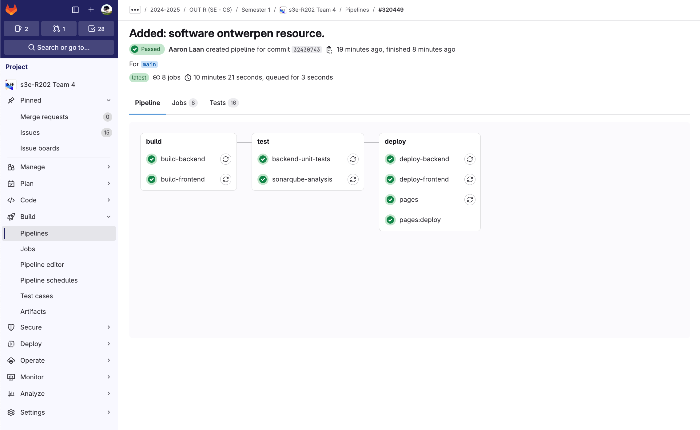
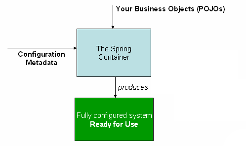

## Backend tests
### Example of a test for the Authentication endpoint
```
    @Test
    public void testAuthenticate() throws Exception {
        JwtRequest jwtRequest = new JwtRequest();
        jwtRequest.setEmail(userDto.getEmail());
        jwtRequest.setPassword(userDto.getPassword());

        mockMvc.perform(post("/auth/authenticate")
                        .contentType(MediaType.APPLICATION_JSON)
                        .content(objectMapper.writeValueAsString(jwtRequest)))
                .andExpect(status().isOk());
    }

```
- [Entire file](https://gitlab.fdmci.hva.nl/semester-3-hbo-ict/onderwijs/student-projecten/2024-2025/out-r-se-cs/semester-1/siiquujuucii98/-/blob/main/backend/src/test/java/dev/visie/elections/AuthenticationControllerTest.java?ref_type=heads)

### Backend tests being ran by GitLab CI

- [Entire file](https://gitlab.fdmci.hva.nl/semester-3-hbo-ict/onderwijs/student-projecten/2024-2025/out-r-se-cs/semester-1/siiquujuucii98/-/blob/main/.gitlab-ci.tests.yml?ref_type=heads)

## Frontend tests
### Example of the test for the login page 
- [Entire file](https://gitlab.fdmci.hva.nl/semester-3-hbo-ict/onderwijs/student-projecten/2024-2025/out-r-se-cs/semester-1/siiquujuucii98/-/blob/main/frontend/cypress/e2e/login.cy.ts?ref_type=heads)

## Dependency injection in springboot

### Field injection
When using field injection, you manually inject the dependencies by annotating the field with `@Autowired`, which is considered a bad practice because it makes the code tightly coupled, and slightly harder to test.
```
    @Autowired
    private UserService userService;
```

Constructor injection is automatically wired by Spring, and it is considered a best practice for dependency injection.
```
    private final UserService userService;

    public UserController(UserService userService) {
        this.userService = userService;
    }
```
### Constructor injection
```
    private final UserService userService;

    @Autowired
    public UserController(UserService userService) {
        this.userService = userService;
    }
```

Spring Boot uses IoC to manage the dependencies in the application. This means that the object lifecycle is managed by the Spring framework, which manages the dependencies and injects them into the classes that require them.
Springboot used beans to manage the dependencies in the application. Beans are objects that are managed by the Spring IoC container. The Spring IoC container is responsible for instantiating, configuring, and assembling the beans.
An example of a bean is the `@Service` annotation, which is used to indicate that a class is a service bean.

Shown below is a diagram of the Inversion of Control (IoC) principle:

### Example of lambda and stream in the codebase
```@Override
public Collection<? extends GrantedAuthority> getAuthorities() {
    return roles.stream()
            .map(role -> new SimpleGrantedAuthority(role.getName().name()))
            .collect(Collectors.toSet());
}
```

### Example of Different Types of Collections in the Codebase

**List:**
File: `backend/src/main/java/dev/visie/elections/service/PartyService.java`
```java
public List<Party> getParties() {
    return partyRepository.findAll();
}
```
A `List` is an ordered collection that allows duplicate elements. It provides positional access and search operations.

**Set:**
File: `backend/src/main/java/dev/visie/elections/service/RatingService.java`
```java
@Override
public Collection<? extends GrantedAuthority> getAuthorities() {
    return roles.stream()
            .map(role -> new SimpleGrantedAuthority(role.getName().name()))
            .collect(Collectors.toSet());
}
```
A `Set` is an unordered collection that does not allow duplicate elements. It is used to store unique elements.

**Map:**
File: `backend/src/main/java/dev/visie/elections/service/SomeService.java`
```java
import java.util.HashMap;
import java.util.Map;

public class SomeService {
    private Map<String, String> exampleMap = new HashMap<>();

    public void addToMap(String key, String value) {
        exampleMap.put(key, value);
    }

    public String getFromMap(String key) {
        return exampleMap.get(key);
    }
}
```
A `Map` is a collection that maps keys to values. It does not allow duplicate keys, and each key can map to at most one value.

### Recursive function in the codebase
I don't have any good examples of a recursive function in the codebase, however on my github I have a project where I used a recursive function.

```java
  /**
     * Recursively finds logs related to the given log by checking each side and recursively moving down the blocks.
     *
     * @param block             the block to start from.
     * @param relatedLogs       the list to store the related logs in.
     * @param visitedBlocks     the set to store the visited blocks in.
     * @param consecutiveLeaves the number of consecutive leaves found.
     * @param airBlocks         the number of air blocks found.
     */
    public List<Block> findRelatedLogs(Block block, List<Block> relatedLogs, Set<Block> visitedBlocks, int consecutiveLeaves, int airBlocks) {
        BlockFace[] faces = {BlockFace.UP, BlockFace.DOWN, BlockFace.NORTH, BlockFace.EAST, BlockFace.SOUTH, BlockFace.WEST};

        for (BlockFace face : faces) {
            Block relativeBlock = block.getRelative(face);

            if (visitedBlocks.add(relativeBlock)) {
                if (materialService.isLog(relativeBlock.getType())) {
                    relatedLogs.add(relativeBlock);
                    findRelatedLogs(relativeBlock, relatedLogs, visitedBlocks, 0, 0);
                } else if (materialService.isLeaf(relativeBlock.getType()) && consecutiveLeaves < settings.getDetection().getLeafRange()) {
                    findRelatedLogs(relativeBlock, relatedLogs, visitedBlocks, consecutiveLeaves + 1, airBlocks);
                } else if (relativeBlock.getType() == Material.AIR && airBlocks <= settings.getDetection().getAirRange()) {
                    findRelatedLogs(relativeBlock, relatedLogs, visitedBlocks, consecutiveLeaves, airBlocks + 1);
                }
            }
        }

        return relatedLogs;
    }
```
- [Entire file](https://github.com/Aaron2404/LazyLumberjack/blob/main/src/main/java/dev/boostio/lazylumberjack/services/BlockService.java)


